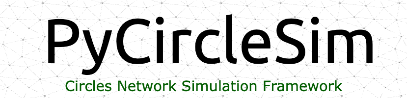

__PyCircleSim__ is a Python framework for simulating and analyzing the Circles protocol through agent-based modeling. It provides comprehensive tools for building test networks, evolving system state, and collecting detailed data about token distributions and trust relationships within the Circles ecosystem.

## Table of Contents

- [Introduction](#introduction)
- [Key Features](#key-features)
- [System Requirements](#system-requirements)
- [Installation](#installation)
- [Project Structure](#project-structure)
- [Configuration](#configuration)
  - [Network Configuration](#network-configuration)
  - [Agent Configuration](#agent-configuration)
- [Agent System](#agent-system)
  - [Agent Profiles](#agent-profiles)
  - [Actions and Behaviors](#actions-and-behaviors)
  - [Trust Dynamics](#trust-dynamics)
- [Data Collection System](#data-collection-system)
  - [Database Schema](#database-schema)
  - [Using the Data Collector](#using-the-data-collector)
  - [Analysis Capabilities](#analysis-capabilities)
- [Running Simulations](#running-simulations)
- [Analysis and Visualization](#analysis-and-visualization)
- [Contributing](#contributing)
- [License](#license)

## Introduction

Circles is a decentralized Universal Basic Income (UBI) protocol built on Gnosis Chain. Each participant can mint their own personal currency, which is trusted and traded within their social network. Understanding how such a complex system evolves over time requires sophisticated simulation tools.

PyCircleSim enables researchers and developers to:
- Create and analyze test networks with multiple agent types
- Model complex trust relationships and trading behaviors
- Simulate temporal evolution and token minting patterns
- Track and analyze detailed system metrics
- Export comprehensive data for further analysis

## Key Features

- **Agent-Based Modeling**: Sophisticated agent system with configurable behaviors and profiles
- **Trust Network Simulation**: Realistic trust relationship formation and evolution
- **Token Economics**: Personal token minting and trading mechanics
- **Data Collection**: Comprehensive event and state tracking
- **Analysis Tools**: Built-in analysis capabilities and data export
- **Configurable Scenarios**: Flexible configuration system for different simulation scenarios

## System Requirements

- Python 3.10 or higher
- Foundry for local blockchain simulation
- Git
- pip package manager
- DuckDB for data storage and analysis

## Installation

1. Install Foundry following instructions at [getfoundry.sh](https://getfoundry.sh/)

2. Clone the repository:
```bash
git clone https://github.com/yourusername/pyCircleSim.git
cd pyCircleSim
```

3. Create and activate a virtual environment:
```bash
python -m venv circles_ape
source circles_ape/bin/activate  # On Windows use: circles_ape\Scripts\activate
```

4. Install the package in development mode:
```bash
pip install -e .
```

## Configuration

### Network Configuration (rings_config.yaml)

The network configuration controls simulation-wide parameters:

```yaml
size: 20                # Network size
trust_density: 0.1      # Target trust density
batch_size: 10         # Processing batch size
iterations: 3          # Number of iterations
blocks_per_iteration: 100  # Blocks per iteration
block_time: 5          # Seconds per block

gas_limits:
  register_human: 500000
  trust: 300000
  mint: 300000
  transfer: 300000
  create_group: 1000000

cache:
  enabled: true
  ttl: 100

db_path: "rings_simulation.duckdb"

trust:
  duration_days: 365
  min_connections: 3
  max_connections: 100
```

### Agent Configuration (agent_config.yaml)

The agent configuration defines different agent profiles and their behaviors:

```yaml
simulation_params:
  initial_balance: 100
  welcome_bonus: 200
  min_gas_price: 1000000000
  max_gas_price: 50000000000

agent_distribution:
  honest_user: 10
  group_creator: 1
  sybil_attacker: 2
  trust_hub: 5

profiles:
  honest_user:
    description: "Regular network participant"
    target_account_count: 1
    max_daily_actions: 20
    risk_tolerance: 0.3
    preferred_contracts: ["circles"]
    actions:
      MINT:
        probability: 0.3
        cooldown_blocks: 240
        gas_limit: 300000
        min_balance: 0
        max_value: 0
        constraints:
          require_previous_mint: false
```

## Agent System

The agent system is built around the concept of configurable profiles that define behavior patterns:

### Agent Profiles

- **Honest User**: Regular network participants with standard behavior
- **Group Creator**: Entities focused on creating and managing groups
- **Sybil Attacker**: Agents that attempt to create multiple identities
- **Trust Hub**: Highly connected nodes that facilitate trust paths

### Actions and Behaviors

Each agent can perform various actions:
- Personal token minting
- Trust relationship establishment
- Token transfers
- Group creation
- Advanced operations (e.g., flow matrix operations)

Actions are governed by:
- Probability of occurrence
- Cooldown periods
- Gas limits
- Balance requirements
- Custom constraints

### Trust Dynamics

Trust relationships are modeled with:
- Directional trust connections
- Trust limits
- Temporal validity
- Network density targeting
- Relationship evolution over time

## Data Collection System

The data collection system uses DuckDB for efficient storage and analysis:

### Database Schema

- **Humans**: Registration data and welcome bonuses
- **Trust Relationships**: Trust connections and limits
- **Balance Changes**: Token movements and minting
- **Network Statistics**: Global metrics and snapshots

### Using the Data Collector

```python
from rings_network import CirclesDataCollector

collector = CirclesDataCollector()

# Record network events
collector.record_human_registration(
    address="0x123...",
    block_number=1000,
    timestamp=current_time
)

# Export data
collector.export_to_csv("analysis_results")
```

### Analysis Capabilities

Built-in analysis queries for:
- Human growth patterns
- Trust network evolution
- Token velocity metrics
- Balance distribution analysis
- Network density calculations

# Running PyCircleSim Simulations

Since PyCircleSim is built as an Ape plugin, we use the `ape run` command to execute simulations. Let me walk you through the complete process of setting up and running simulations.

## Prerequisites Setup

Before running simulations, ensure you have:

1. Installed Foundry for local blockchain simulation:
```bash
curl -L https://foundry.paradigm.xyz | bash
foundryup
```

2. Installed Ape and required plugins:
```bash
pip install eth-ape
ape plugins install solidity foundry etherscan
```

3. Created and activated your Python virtual environment:
```bash
python -m venv circles_ape
source circles_ape/bin/activate  # On Windows use: circles_ape\Scripts\activate
```

4. Installed PyCircleSim in development mode:
```bash
pip install -e .
```

## Configuration Files

The simulation requires two configuration files:

1. `rings_network/config/rings_config.yaml` - Network-level configuration:
```yaml
size: 20              
trust_density: 0.1    
batch_size: 10        
iterations: 3         
blocks_per_iteration: 100
block_time: 5        

gas_limits:
  register_human: 500000
  trust: 300000
  mint: 300000
  transfer: 300000
  create_group: 1000000
```

2. `rings_network/config/agent_config.yaml` - Agent behavior configuration:
```yaml
agent_distribution:
  honest_user: 10
  group_creator: 1
  sybil_attacker: 2
  trust_hub: 5

profiles:
  honest_user:
    description: "Regular network participant"
    target_account_count: 1
    max_daily_actions: 20
    # ... additional profile settings
```

## Running the Simulation

To run the simulation with the default configuration files:

```bash
ape run rings simulate \
  --rings-config rings_network/config/rings_config.yaml \
  --agent-config rings_network/config/agent_config.yaml
```

You can also override specific parameters:

```bash
ape run rings simulate \
  --rings-config rings_network/config/rings_config.yaml \
  --agent-config rings_network/config/agent_config.yaml \
  --network-size 1000 \
  --trust-density 0.2 \
  --iterations 5
```

### Available Command-line Options

- `--rings-config`: Path to network configuration file
- `--agent-config`: Path to agent configuration file
- `--network-size`: Override network size
- `--trust-density`: Override trust density
- `--batch-size`: Override processing batch size
- `--iterations`: Override number of iterations
- `--blocks-per-iteration`: Override blocks per iteration

## Monitoring the Simulation

During execution, the simulation provides real-time feedback:

1. Initialization messages:
```
Starting simulation with configuration:
Network size: 1,000 agents
Trust density: 0.1
Iterations: 3
```

2. Progress updates:
```
Building initial network...
Processing iteration 1/3...
Processing iteration 2/3...
Processing iteration 3/3...
```

3. Detailed statistics after each iteration:
```
Iteration 1 complete:
  - Total actions: 450
  - Mints: 120
  - Trusts: 89
  - Transfers: 234
  - Groups created: 7
```

## Analyzing Results

After the simulation completes, analyze the results using:

```bash
ape run rings analyze
```

This will process the collected data and generate:
- Network growth statistics
- Trust relationship analysis
- Token velocity metrics
- Balance distribution patterns

Results are stored in the `simulation_results` directory with a timestamp:
```
simulation_results/
└── sim_20241216_143022/
    ├── agent_statistics.csv
    ├── iteration_statistics.csv
    ├── event_logs.csv
    ├── network_snapshots.csv
    └── simulation_metadata.json
```

## Troubleshooting

Common issues and solutions:

1. **Foundry Connection Error**:
   - Ensure Foundry is running with `anvil`
   - Check your `ape-config.yaml` network settings

2. **Configuration File Not Found**:
   - Verify paths are relative to your current directory
   - Use absolute paths if needed

3. **Out of Gas Errors**:
   - Increase gas limits in rings_config.yaml
   - Reduce batch size for complex operations

4. **Database Errors**:
   - Ensure DuckDB has write permissions
   - Check available disk space

For additional help, check the logs in `rings_simulation.log` or raise an issue on our GitHub repository.

## License

This project is licensed under the MIT License - see the [LICENSE](LICENSE) file for details.